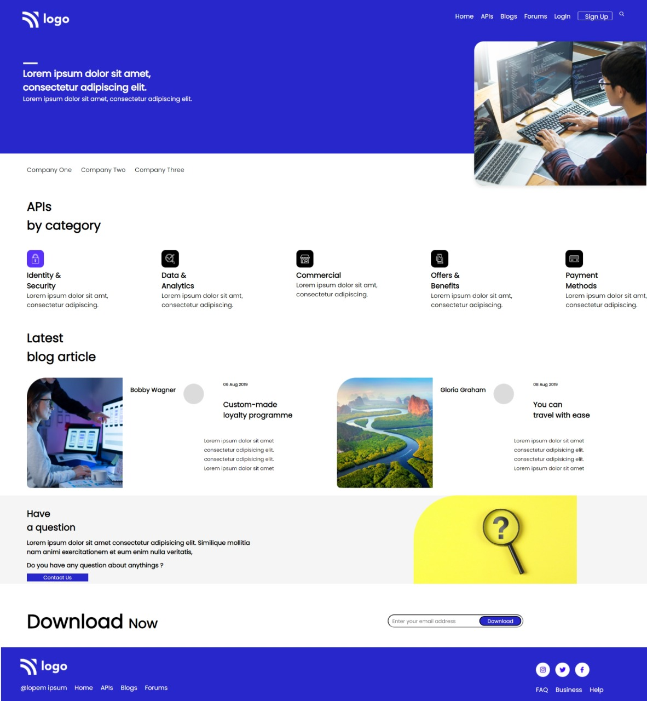

# Project-09-  Development Landing Page.

 ## Hey there ,  I am Amarjeet 
 I have built a template of HTML and CSS project using my core css skills .
 
 My website is fully responsive in behaviour.
 
 you can see it any types of device.
 
 
 
 

  

 My Live Deployed Website Link:- [Click here !](https://project-09-web-page-template.netlify.app/)

 
 

 ## For making this project I spend almost 8 hours.

 ## What I learned from this project 
 - Most important thing which i learned from this projecy is about position and flex box .
 - also I explore about input .
 - For making responsive website mainly I used media query and flex box.
  
